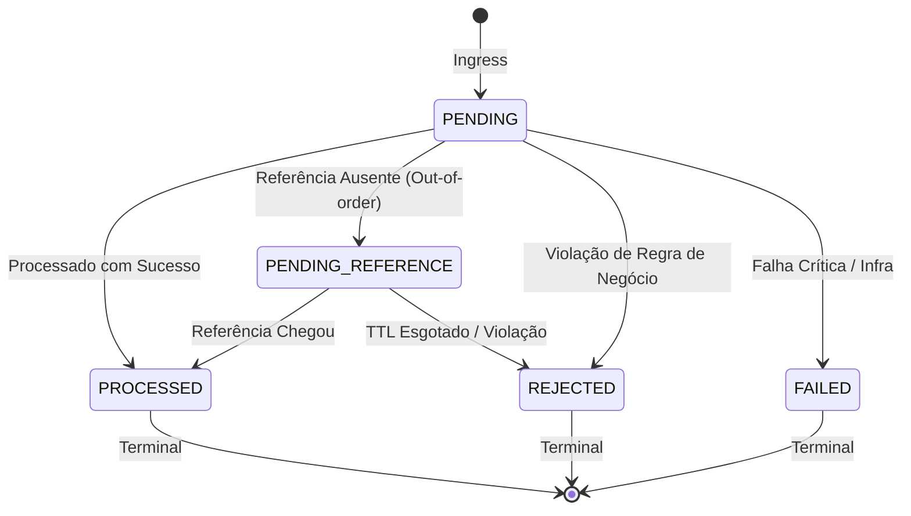
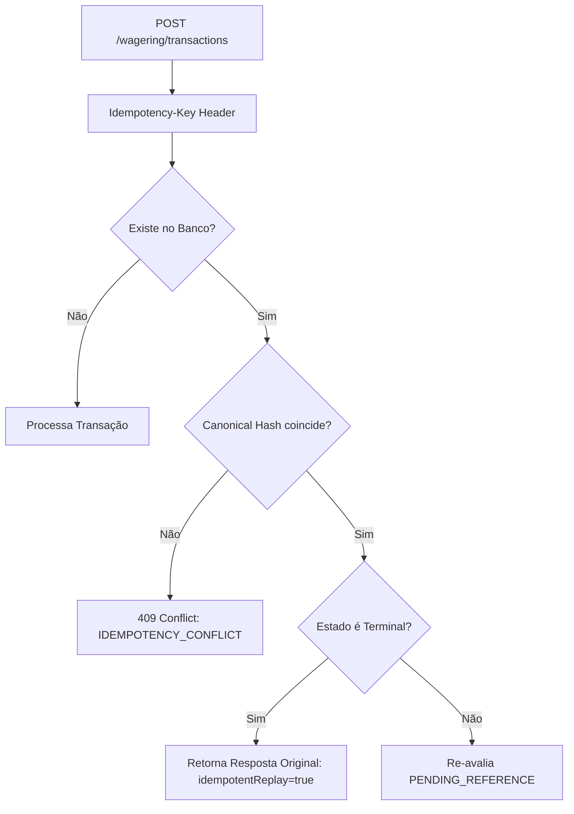
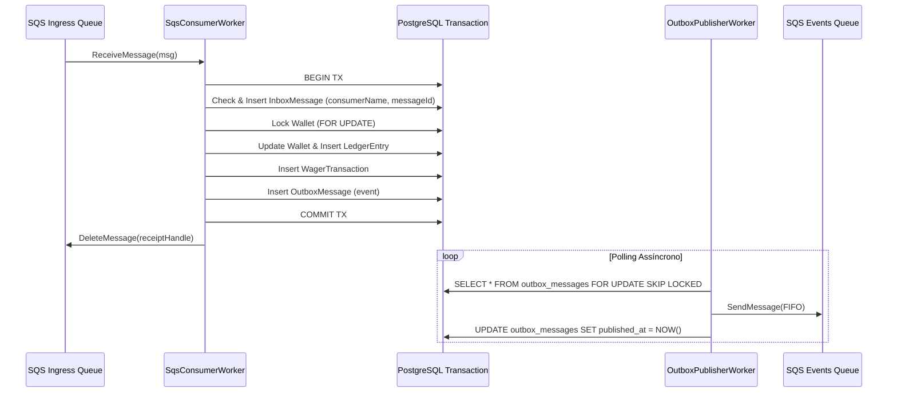

# Architecture Design Document — Distributed Wagering Processor
**Plataforma de Processamento Distribuído de Apostas (iGaming)**  
*Jungle Gaming Technical Architecture Specification*

---

## 1. Visão Geral e Objetivos do Sistema

O **Distributed Wagering Processor** é um motor financeiro de alta confiabilidade projetado para processar transações de apostas (*Bets*), prêmios (*Wins*), perdas (*Losses*), reembolsos (*Refunds*) e reversões (*Rollbacks*) originadas de múltiplos provedores de jogos de cassino online.

### 1.1 Invariantes Globais Inegociáveis
1. **Conservação de Saldo e Precisão Monetária:** Não é tolerada perda de precisão, arredondamento em ponto flutuante ou saldo negativo.
2. **Imutabilidade e Consistência de Ledger:** Todo movimento que afeta saldo produz exatamente um lançamento no ledger contábil na mesma transação de banco. O saldo materializado na carteira é sempre igual à soma vetorial dos lançamentos do ledger:
   $$\text{Wallet.Balance} \equiv \sum_{i=1}^{n} \text{LedgerEntry}_i$$
3. **Idempotência Estrita em Camadas:** Nenhuma operação financeira é executada mais de uma vez. Replays com o mesmo payload retornam o resultado idêntico original; alterações de payload para a mesma chave são rejeitadas como conflito (`409 Conflict`).
4. **Isolamento de Concorrência por Carteira:** Operações concorrentes para uma mesma carteira (`walletId`) são serializadas de maneira determinística, garantindo ausência de *lost updates*, *race conditions* ou débitos duplicados.
5. **Atomicidade e Resiliência em Redes Distribuídas:** Utilização do *Transactional Outbox Pattern* e *Transactional Inbox Pattern* para garantir entrega *at-least-once* e publicação garantida de eventos de integração pós-commit.

---

## 2. Decisões de Stack e Justificativas Técnicas

| Componente | Tecnologia | Justificativa Técnica |
|---|---|---|
| **Runtime & Test Runner** | **Bun 1.x** | Inicialização instantânea, motor JavaScript de alta performance (JSC), test runner ultra-rápido nativo e compatibilidade nativa com TypeScript. |
| **Framework** | **NestJS 11** | Arquitetura modular corporativa com inversão de dependência (IoC), suporte maduro a lifecycle hooks para workers assíncronos e ecossistema robusto. |
| **Linguagem** | **TypeScript (Strict Mode)** | Tipagem estática rigorosa para domínio financeiro, eliminação de nulos imprevistos e separação clara de interfaces de portas. |
| **Banco de Dados** | **PostgreSQL 16** | Robustez ACID, suporte a `NUMERIC(20,2)`, constraints de tabela, triggers de imutabilidade, partial unique indexes e `SELECT ... FOR UPDATE SKIP LOCKED`. |
| **ORM / Data Mapper** | **MikroORM 7** | **Decisão Estratégica:** Ao contrário de ORMs ativos como TypeORM ou Prisma, o MikroORM baseia-se no padrão **Data Mapper**, **Unit of Work** e **Identity Map**. Ele permite mapeamento desacoplado via `EntitySchema` externo, preservando as entidades de domínio 100% puras (POJOs sem decorators de ORM), além de oferecer controle direto de `EntityManager.transactional()` e locks pessimistas nativos (`LockMode.PESSIMISTIC_WRITE`). |
| **Mensageria** | **AWS SQS FIFO** | Filas FIFO com `MessageGroupId` particionado por `walletId` para ordenação estrita por carteira, `MessageDeduplicationId` e integração resiliente com Dead Letter Queue (DLQ). |

---

## 3. Modelo de Domínio (DDD) e Precisão Financeira

O domínio é estritamente isolado da camada de persistência e de frameworks web.

```
src/domain
├── money/                  # Value Object Money (decimal.js)
├── wallet/                 # Aggregate Root Wallet & Entity Imutável WalletLedgerEntry
├── wagering/               # Aggregate WagerTransaction com State Machine
├── messaging/              # Entidades de InboxMessage e OutboxMessage
└── events/                 # Eventos de Integração Versionados
```

### 3.1 Value Object `Money`
- O JavaScript representa números como `IEEE 754 double precision float`, o que introduz erros de representação inaceitáveis (ex: `0.1 + 0.2 !== 0.3`).
- Toda a aritmética monetária é encapsulada na classe imutável `Money` utilizando internamente a biblioteca `decimal.js`.
- **Invariantes do Value Object:**
  - Valores são serializados como string decimal de 2 casas decimais fixas (ex: `"25.00"`).
  - Rejeição de `NaN`, `Infinity`, notação científica, strings vazias ou valores de entrada negativos na factory pública `Money.from()`.
  - Operações aritméticas (`add`, `subtract`, `negate`, `isLessThan`, `equals`) exigem a mesma moeda (`ISO-4217`), disparando `CurrencyMismatchError` em caso de divergência.
  - Imutabilidade absoluta: cada método retorna uma nova instância de `Money`.

### 3.2 Aggregate Root `Wallet`
- Encapsula o saldo `_balance: Money` e a versão `_version: number`.
- Construtor privado; instância instanciada exclusivamente via `Wallet.open()` (nova) ou `Wallet.rehydrate()` (reconstrução da persistência sem revalidar transições).
- Métodos `debit(amount: Money)` e `credit(amount: Money)` que verificam a consistência da moeda e impedem que o saldo fique negativo, lançando `InsufficientFundsError`.

### 3.3 Entidade Imutável `WalletLedgerEntry`
- Representa um lançamento contábil no livro-razão (*Single-Entry Ledger*).
- Campos estruturalmente imutáveis (`readonly`): `walletId`, `transactionId`, `direction (DEBIT | CREDIT)`, `money`, `balanceBefore`, `balanceAfter`, `createdAt`.
- Factory `WalletLedgerEntry.create()` valida matematicamente:
  - Se `direction == DEBIT`: $\text{balanceBefore} - \text{money} = \text{balanceAfter}$
  - Se `direction == CREDIT`: $\text{balanceBefore} + \text{money} = \text{balanceAfter}$
  - Se a equação não fechar, a criação falha com erro de domínio.
- **Proteção em Nível de Banco de Dados:** Além do código, a tabela `wallet_ledger_entries` possui triggers PostgreSQL que lançam exceções imediatas em qualquer tentativa de `UPDATE` ou `DELETE`.

---

## 4. Máquina de Estados e Resolução de Reversões

As transações de apostas seguem a máquina de estados abaixo:



### 4.1 Validação Estrita de Reversões (REFUND & ROLLBACK)
Conforme a Seção 7 do edital, toda operação de reversão passa por checagens rigorosas:
1. **Existência da Referência:** Se a transação referenciada ainda não existe no banco, o sistema transiciona para `PENDING_REFERENCE` e responde `HTTP 202 Accepted`.
2. **Status da Referência:** Deve estar em `PROCESSED`. Se estiver `PENDING` ou `REJECTED`, rejeita com `REFERENCE_NOT_PROCESSED`.
3. **Consistência de Contexto:** A referência deve pertencer ao mesmo `playerId`, `walletId`, `roundId` e `currency`. Falhas geram `PLAYER_MISMATCH`, `WALLET_NOT_FOUND` ou `ROUND_MISMATCH`.
4. **Valor Exato:** Reversões parciais estão fora de escopo. O valor deve ser idêntico (`REVERSAL_AMOUNT_MISMATCH`).
5. **Tipos Permitidos:**
   - `REFUND` só pode referenciar `BET` (`REFUND_ONLY_FOR_BET`).
   - `ROLLBACK` pode referenciar `BET`, `WIN` ou `REFUND` (`INVALID_REFERENCE_KIND`).
6. **Prevenção de Duplicidade:** O banco de dados aplica um índice único parcial:
   ```sql
   CREATE UNIQUE INDEX uq_reversal_per_reference
     ON wager_transactions (reference_transaction_id, kind)
     WHERE status = 'PROCESSED' AND kind IN ('REFUND', 'ROLLBACK');
   ```
7. **Diferenciação de Saldo Negativo em Reversão:** Se um `ROLLBACK` de um ganho anterior falhar por falta de fundos, ele rejeita com `REVERSAL_WOULD_CAUSE_NEGATIVE_BALANCE` (e não `INSUFFICIENT_FUNDS`), diferenciando a falha operacional de uma aposta simples.

### 4.2 Reprocessamento de `PENDING_REFERENCE` (Out-of-Order Delivery)
- O worker [`PendingReferenceWorker`](file:///C:/Users/wesle/.gemini/antigravity/scratch/distributed-wagering-processor/src/infrastructure/messaging/pending-reference.worker.ts) realiza polling a cada 5 segundos nas transações `PENDING_REFERENCE`.
- Reinjeta a transação no caso de uso principal. O caso de uso atualiza a mesma instância existente no banco (`update`).
- **Política de TTL (Time-To-Live):** Transações que permanecerem em `PENDING_REFERENCE` por mais de 60 segundos (configurável via `PENDING_REFERENCE_TTL_MS`) são transicionadas para `REJECTED` com `FailureCode.ReferenceNotFound` e emitem evento `WagerTransactionRejected` via outbox.

---

## 5. Estratégia de Concorrência e Isolamento

### 5.1 Justificativa do Pessimistic Locking na Carteira
Para processamento financeiro de apostas em tempo real com hot wallets (ex: um jogador executando múltiplas apostas simultâneas via autospin ou múltiplos provedores):
- **Optimistic Locking (`version` column):** Sob alta contenção, gera alto índice de `OptimisticLockException` e obriga retries no nível de aplicação, aumentando latência e consumo de CPU.
- **Pessimistic Locking (`SELECT ... FOR UPDATE`):** Adotado pelo sistema através de `walletRepository.findByIdForUpdate(walletId)`.
  - Apenas transações da **mesma carteira** são bloqueadas em fila no banco de dados.
  - Carteiras diferentes são processadas em **paralelo absoluto** sem nenhum gargalo.
  - Elimina completamente *lost updates* e garante que a decisão de débito/crédito seja tomada contra o saldo mais recente garantido por lock de linha do Postgres.

---

## 6. Garantia de Idempotência Persistente



1. **Header HTTP como Fonte da Verdade:** `Idempotency-Key` é lido do header HTTP. Se ausente, adota o padrão `${providerId}:${externalTransactionId}`.
2. **Canonical JSON SHA-256 Hasher:** O payload de negócio é normalizado (chaves de objetos ordenadas lexicograficamente de forma recursiva, ignorando campos de transporte) e transformado em um hash SHA-256 de 64 caracteres.
3. **Detecção de Replay vs Conflito:**
   - **Mesma chave + mesmo hash + estado terminal:** Retorna a resposta persistida com `idempotentReplay: true`.
   - **Mesma chave + hash diferente:** Dispara `IDEMPOTENCY_CONFLICT` (`HTTP 409 Conflict`).

---

## 7. Mensageria Distribuída: Transactional Outbox & Inbox



### 7.1 Transactional Inbox
- Garante deduplicação no consumidor SQS em chave composta `(consumer_name, message_id)`.
- O registro de recebimento do inbox é persistido na **mesma transação SQL** que atualiza o saldo e grava o ledger.
- Se o consumidor cair antes de enviar o ACK ao SQS, a mensagem será reentregue, o inbox identificará que ela já foi processada e descartará o processamento repetido sem tocar no saldo.

### 7.2 Transactional Outbox
- Garante que nenhum evento de integração seja publicado sem que o banco tenha feito commit, e que nenhum evento confirmado seja perdido em caso de crash do processo.
- **Concorrência entre Múltiplos Publishers:** O `OutboxPublisherWorker` utiliza a cláusula `FOR UPDATE SKIP LOCKED` do PostgreSQL:
  ```sql
  SELECT * FROM outbox_messages
  WHERE published_at IS NULL AND (next_attempt_at IS NULL OR next_attempt_at <= NOW())
  ORDER BY occurred_at ASC
  LIMIT 50
  FOR UPDATE SKIP LOCKED;
  ```
  Isso permite que 10 ou mais instâncias do serviço executem o publisher concorrentemente sem risco de processamento duplicado ou contenção de lock.

---

## 8. Autenticação e Provedor de Identidade (IdP)

### 8.1 Decisão e Racional de Arquitetura
Conforme a Seção 2 do edital técnico, a autenticação não deve concorrer com as garantias financeiras nem ser implementada de forma artesanal (sem tabelas locais de usuário/senha).

1. **Arquitetura de Produção Recomendada:**
   - Integração com um **Identity Provider externo** via OIDC/OAuth 2.0 (ex: Keycloak ou Zitadel).
   - O provedor de jogos autentica-se via *Client Credentials Grant* (`mTLS` ou `private_key_jwt`) obtendo um JWT assinado.
   - O API Gateway / NestJS valida o token de forma stateless (verificação da chave pública JWKS) e injeta o `providerId` verificado no contexto de execução.
2. **Ponto de Extensão no Código:**
   - O serviço declara explicitamente o ponto de acoplamento de segurança através de um `NoOpAuthGuard` / `ProviderIdentityPort` no módulo de apresentação, permitindo plugar o middleware JWT sem alterações nas regras de negócio.
   - Os endpoints de monitoramento (`/health/live`, `/health/ready`, `/metrics`) operam publicamente sem autenticação.

---

## 9. Observabilidade e Telemetria

1. **Logs Estruturados:** Formato padronizado contendo `timestamp`, `level`, `context`, `correlationId`, `transactionId`, `walletId`, `providerId`, omitindo dados sensíveis ou informações confidenciais do jogador.
2. **Métricas Prometheus (`/metrics`):**
   - `wagering_transactions_total{status, kind, provider}`: Total de transações processadas.
   - `wagering_idempotency_conflicts_total`: Conflitos de payload detectados.
   - `wagering_reversals_total{kind, status}`: Reversões processadas e seus estados.
   - `wagering_processing_duration_seconds`: Histograma de latência do motor financeiro.
   - `wagering_outbox_lag`: Volume de mensagens pendentes na outbox.
3. **Health Checks:**
   - `GET /health/live`: Retorna status do processo e uptime (HTTP 200).
   - `GET /health/ready`: Valida conectividade real com PostgreSQL e LocalStack SQS, retornando HTTP 200 se operacionais ou HTTP 503 caso algum esteja indisponível.

---

## 10. Trade-offs e Limitações Conhecidas

1. **Pessimistic Lock vs Throughput em Hot Wallets:**
   - *Trade-off:* O lock de linha no Postgres limita o throughput máximo teórico de uma **única** carteira à velocidade de I/O de escrita do banco (~500 a 1.500 tx/s por carteira individual).
   - *Mitigação:* Em iGaming real, um usuário humano nunca gera mais de 5 a 10 apostas/s. Como o particionamento é por `walletId`, a capacidade global escala horizontalmente para milhares de carteiras simultâneas.
2. **At-Least-Once Delivery na Outbox:**
   - *Trade-off:* Se o worker publicar no SQS e o processo morrer antes do `UPDATE published_at`, a mensagem poderá ser republicada.
   - *Mitigação:* Os consumidores dos eventos de saída utilizam o `eventId` / `deduplicationId` para deduplicação idempotente no destino.
